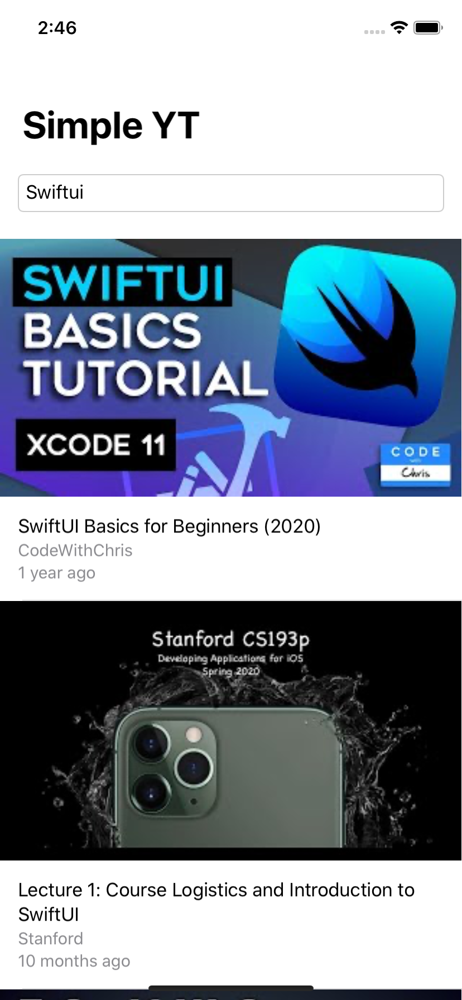
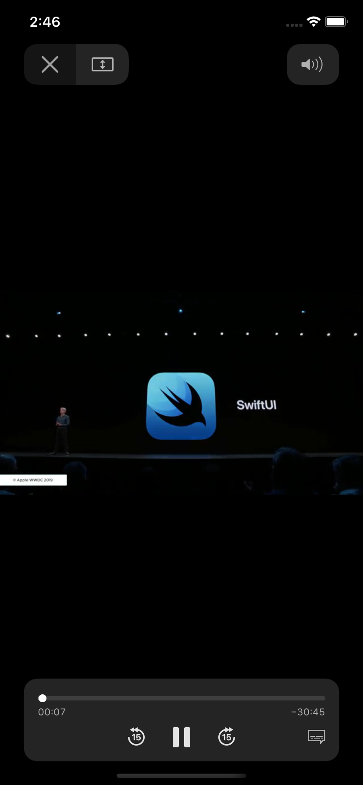
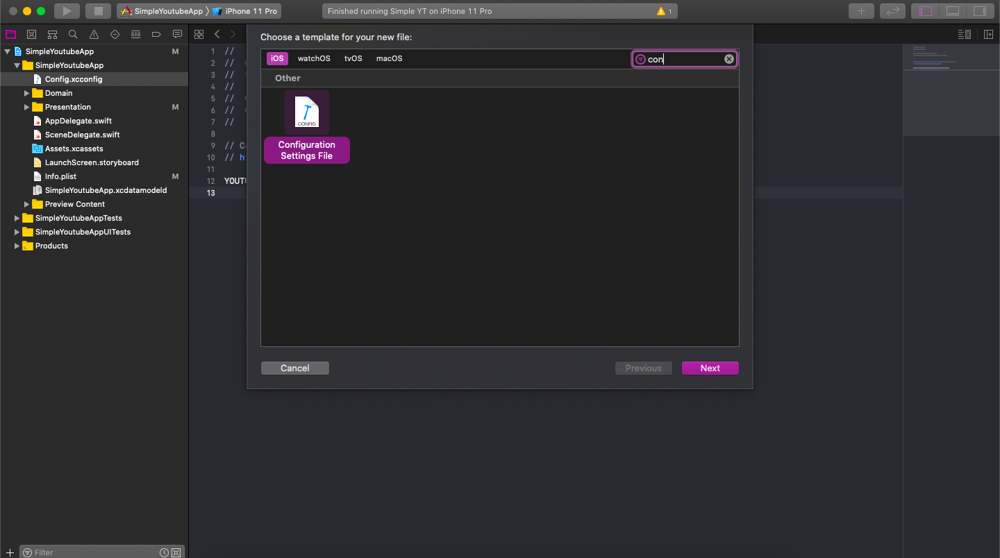
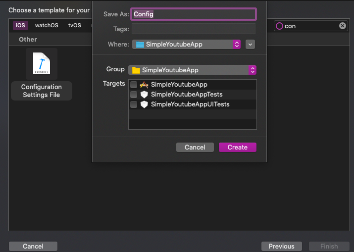
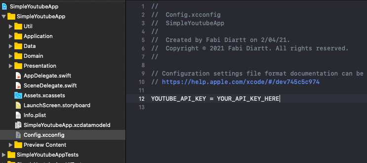
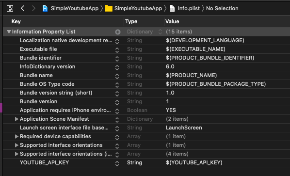
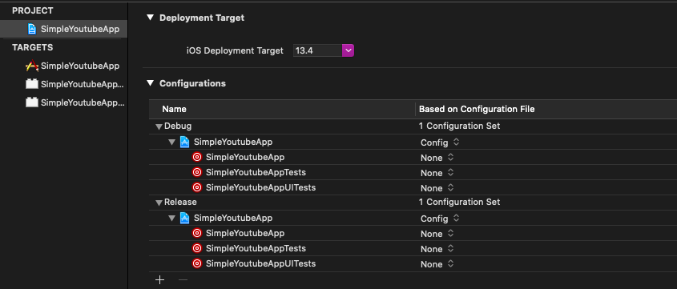

# SwiftUI - YouTube video player

Simple iOS Youtube video player App using [Youtube API](https://developers.google.com/youtube/v3) and SwiftUI.

YouTubePlayerView provided by [Swift-YouTube-Player](https://github.com/gilesvangruisen/Swift-YouTube-Player).

SwiftUI implementation of the YouTubePlayer: [Implementing a YouTube Player in SwiftUI](https://medium.com/@mikolukasik/implementing-a-youtube-player-in-swiftui-ff386fdfd1fb).

## Features
- SwiftUI
- MVVM Architecture
- Networking
- Web images
- Error handling
- Pagination / Infinite scroll

## Screenshots

|  |  |
|----------|:-------------:|

## Setup

### Dependencies

Install the project dependencies using Cocoapods.
```
SimpleYoutubeApp % pod install
```

### Configuration file

1. Create the configuration file `Config`.





2. Add your YouTube API key.



3. Verify you have `YOUTUBE_API_KEY` in the `Info.plist` file.



4. Add the `Config` file to your build configurations.


